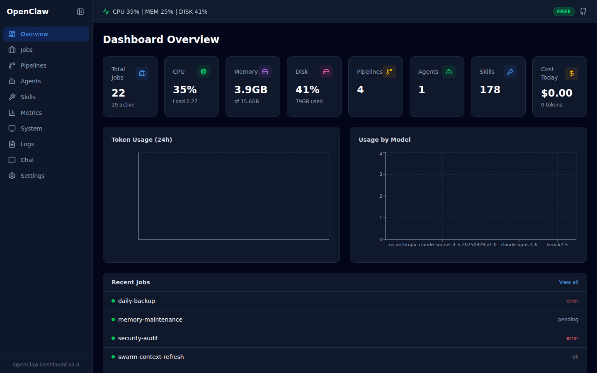
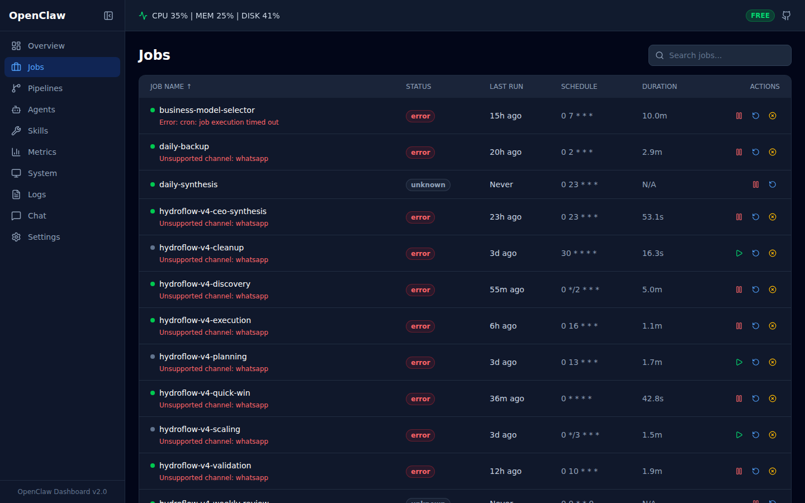
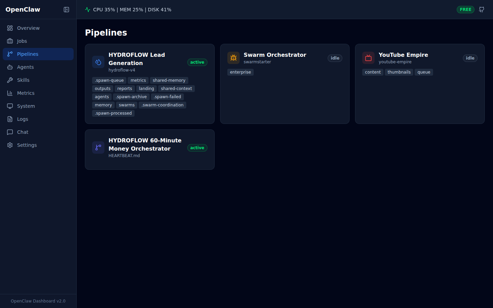
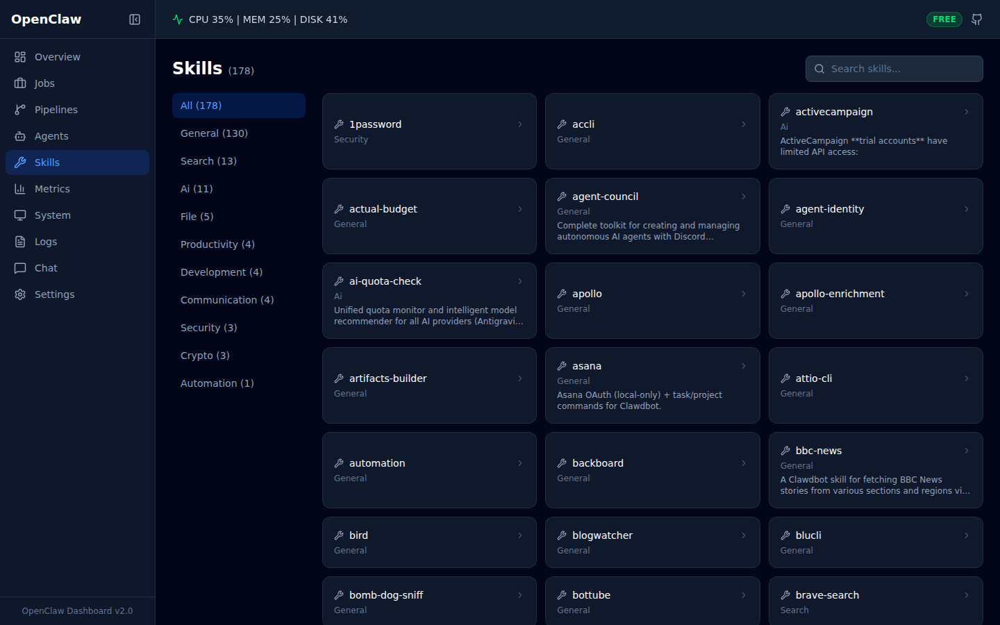
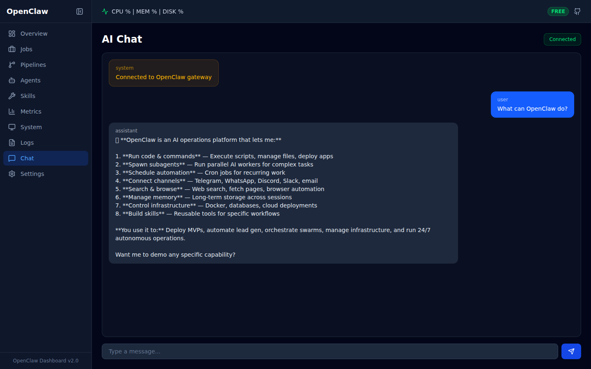

# OpenClaw Dashboard

A free, open-source monitoring dashboard for [OpenClaw](https://openclaw.ai) AI agent workflows.




## What It Does

OpenClaw Dashboard gives you a single web interface to monitor and control everything in your OpenClaw workspace:

- **Overview** — Real-time stats: active jobs, token usage, costs, system health
- **Jobs** — View, search, and control all cron jobs (enable/disable/run now)
- **Pipelines** — Auto-discovered pipelines with status and stage visualization
- **Agents** — Detected agents with type classification and capabilities
- **Skills** — Browse installed skills with categories, search, and README viewer
- **Metrics** — Token usage charts, cost breakdown by model, daily trends
- **System** — CPU, memory, and disk gauges with health checks
- **Logs** — Real-time log viewer with search and auto-scroll
- **Chat** — AI chat proxy to the OpenClaw gateway
- **Settings** — Discovery engine status, manual re-scan, system info

## Screenshots

| Jobs | Pipelines |
|------|-----------|
|  |  |

| Skills | System |
|--------|--------|
|  |  |

| Metrics | Chat |
|---------|------|
|  |  |

## Quick Start

### Prerequisites

- Python 3.10+
- Node.js 18+
- An OpenClaw installation (the dashboard reads from `~/.openclaw/`)

### 1. Clone and install

```bash
git clone https://github.com/LvcidPsyche/openclaw-dashboard.git
cd openclaw-dashboard

# Backend
cd backend
pip install -r requirements.txt

# Frontend
cd ../frontend
npm install
```

### 2. Configure (optional)

```bash
cp backend/.env.example backend/.env
# Edit backend/.env with your paths
```

The defaults work if OpenClaw is installed at `~/.openclaw/`.

### 3. Run

**Development** (hot reload on both ends):

```bash
# Terminal 1 — Backend
cd backend
PYTHONPATH=. python -m app.main

# Terminal 2 — Frontend dev server
cd frontend
npm run dev
```

**Production** (single process, single port):

```bash
# Build the frontend
cd frontend && npm run build && cd ..

# Run everything on port 8765
cd backend
PYTHONPATH=. python -m app.main
```

The backend serves the built frontend automatically — no separate web server needed.

## Project Structure

```
backend/
  app/
    main.py              # FastAPI entry point
    config.py            # Environment-based settings (Pydantic)
    routers/             # API modules
      overview.py        #   GET  /api/overview
      jobs.py            #   GET  /api/jobs, POST /api/jobs/control
      metrics.py         #   GET  /api/metrics/*
      system.py          #   GET  /api/system/*
      sessions.py        #   GET  /api/sessions
      chat.py            #   POST /api/chat, WS /ws/chat
      logs.py            #   GET  /api/logs/*
      discovery.py       #   GET  /api/discovery
    services/
      job_service.py     # Cron job data + control
      cache_trace.py     # Token/cost analytics (streaming reader)
    discovery/
      engine.py          # Auto-discovery engine
      patterns.py        # Pipeline/agent/skill detection patterns
    models/
      schemas.py         # Pydantic response models
    websocket/
      manager.py         # Multi-channel WebSocket manager
  requirements.txt
  .env.example

frontend/
  src/
    pages/               # 10 page components
    components/
      layout/            # Sidebar, Header, Layout
      common/            # StatCard, StatusBadge, EmptyState, LoadingState
    api/                 # Typed fetch client + endpoints
    store/               # Zustand global state
    hooks/               # usePolling
    utils/               # Formatters
```

## Discovery Engine

The dashboard includes an auto-discovery engine that scans your OpenClaw workspace and detects:

| What | How |
|------|-----|
| **Pipelines** | Matches directory names against known patterns (HYDROFLOW, YouTube Empire, Content Factory, etc.) and checks file modification times for active/idle status |
| **Agents** | Scans agent config directories for JSON files with agent definitions, classifies by type (coder, researcher, writer, devops, etc.) |
| **Skills** | Enumerates `workspace/skills/`, auto-categorizes by name, reads README.md for descriptions |
| **Modules** | Checks for known custom module directories |

Discovery runs automatically every 5 minutes. You can trigger a manual re-scan from the Settings page or via `POST /api/discovery/refresh`.

## API Reference

| Method | Endpoint | Description |
|--------|----------|-------------|
| `GET` | `/api/overview` | Dashboard summary stats |
| `GET` | `/api/jobs` | All cron jobs with status |
| `POST` | `/api/jobs/control` | Control a job (enable/disable/run) |
| `GET` | `/api/metrics/tokens` | Token usage by model |
| `GET` | `/api/metrics/timeseries` | Time-series usage data |
| `GET` | `/api/metrics/breakdown` | Cost/token breakdown |
| `GET` | `/api/system/resources` | CPU, memory, disk stats |
| `GET` | `/api/system/health` | Service health checks |
| `GET` | `/api/system/devices` | Paired devices |
| `GET` | `/api/sessions` | Active sessions |
| `GET` | `/api/pipelines` | Discovered pipelines |
| `GET` | `/api/agents` | Discovered agents |
| `GET` | `/api/skills` | Skills (search, filter, paginate) |
| `GET` | `/api/skills/categories` | Skill category counts |
| `GET` | `/api/skills/{name}` | Skill detail + README |
| `GET` | `/api/discovery` | Full discovery result |
| `POST` | `/api/discovery/refresh` | Trigger re-scan |
| `GET` | `/api/logs/files` | Available log files |
| `GET` | `/api/logs/tail` | Tail a log file |
| `POST` | `/api/chat` | Send message to gateway |
| `GET` | `/api/chat/status` | Gateway availability |
| `WS` | `/ws/chat` | WebSocket chat |
| `WS` | `/ws/realtime` | Real-time overview updates |

Interactive API docs available at `/docs` when the server is running.

## Tech Stack

| Layer | Technology |
|-------|-----------|
| Backend | FastAPI, Uvicorn, Pydantic, httpx, psutil |
| Frontend | React 19, TypeScript 5.9, Vite 7 |
| Styling | Tailwind CSS 4 |
| Charts | Recharts 3 |
| State | Zustand 5 |
| Icons | Lucide React |
| Routing | React Router 7 |

## Environment Variables

All variables are prefixed with `OPENCLAW_DASH_`. See [`backend/.env.example`](backend/.env.example) for the full list.

| Variable | Default | Description |
|----------|---------|-------------|
| `OPENCLAW_DIR` | `~/.openclaw` | OpenClaw installation path |
| `GATEWAY_URL` | `http://localhost:18789` | Gateway HTTP URL |
| `GATEWAY_WS_URL` | `ws://127.0.0.1:18789` | Gateway WebSocket URL |
| `PORT` | `8765` | Server port |
| `DISCOVERY_INTERVAL_SECONDS` | `300` | Auto-discovery refresh interval |

## Contributing

Contributions are welcome. Please open an issue first to discuss what you'd like to change.

## License

[MIT](LICENSE)
